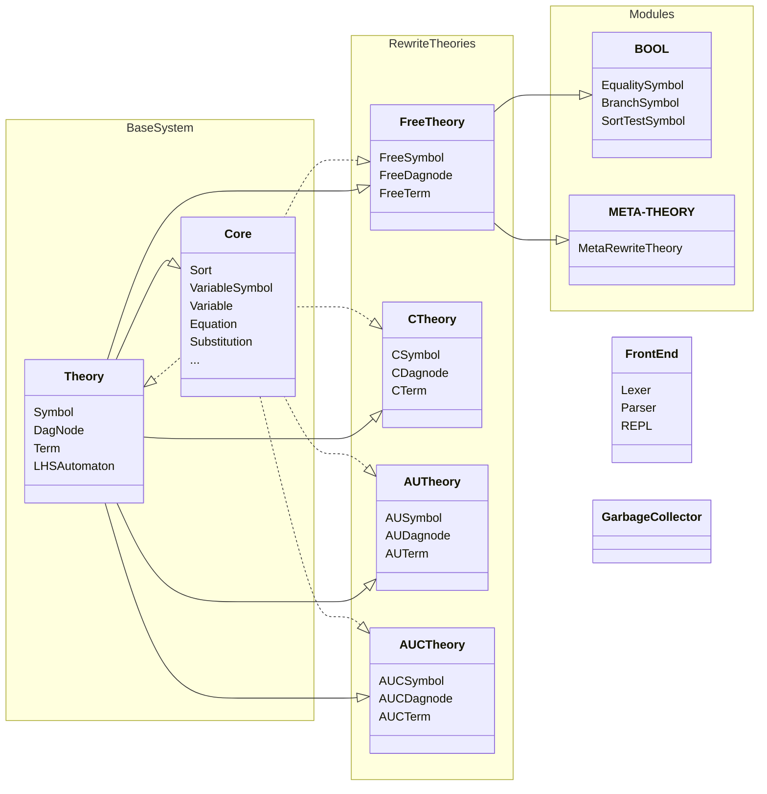

Portions of this document are quoted from [Clavel et al.], which is published under the 
[Attribution-NonCommercial-NoDerivs 3.0 Unported (CC BY-NC-ND 3.0)](https://creativecommons.org/licenses/by-nc-nd/3.0/)
license.

> Clavel, M., Eker, S., Lincoln, P., & Meseguer, J. (1996). Principles of Maude. Electronic Notes in Theoretical 
> Computer Science, 4, 65-89. doi: 10.1016/S1571-0661(04)00034-9

# Architecture



For most uses terms are represented as trees, in which nodes are decorated with all kinds of information to simplify
parse time analysis For the subject term being rewritten, however, a directed acyclic graph DAG representation is used
with very compact nodes.

The innermost layer consists of the modules _Core_ ("Core Facilities") and Theory ("Theory API"). The Theory Interface
consists of abstract classes for basic objects whose concrete realization will differ for different equational theories,
such as: symbols, dag nodes, terms, lefthand side automata (for matching), righthand side automata (for constructing and
normalizing righthand side and condition instances), matching subproblems and matching extension information. Some of
the classes in the Theory Interface contain some concrete data and function members to provide useful common
functionality to derived classes. The Core Facilities module consists of concrete classes for basic objects that are
independent of the different equational theories, such as: sorts, connected components (kinds), variable symbols,
variables (as terms), equations, sort constraints, rules, sequences of matching subproblems and substitutions. Neither
the Core Facilities nor the Theory Interface treat any sort, symbol or equational theory as special in any way
whatsoever; all are manipulated through virtual functions in the abstract classes belonging to the Theory Interface. In
particular, this means that the code that handles conditional equations knows nothing about the Maude built in sort Bool
and its built in constants true and false. ...

Performance enhancing techniques implemented in the current prototype include:

 * Fixed size dag nodes for in-place replacement.
 * ull indexing for the topmost free function symbol layer of patterns; when the patterns for some free symbol only
   contain free symbols this is equivalent to matching a subject against all the patterns simultaneously.
 * Use of _greedy matching algorithms_, which attempt to generate a single matching substitution as fast as possible for
   patterns and subpatterns that are simple enough and whose variables satisfy certain conditions (such as not appearing
   in a condition). If a greedy matching algorithm fails it may be able to report that no match exists; but it is also
   allowed to report 'undecided' in which case the full matching algorithm must be used.
 * Use of binary search during AC matching for fast elimination of ground terms and previously bound variables.
 * se of a specially designed sorting algorithm which uses additional information to speed up the renormalization of AC
   terms.
 * Use of a Boyer-Moore style algorithm for matching under associative function symbols.
 * Compile time analysis of sort information to avoid needless searching during associative and AC matching.
 * ompile time analysis of non-linear variables in patterns in order to propagate constraints on those variables in an
   'optimal' way and reduce the search space.
 * Compile time allocation of fixed size data structures needed at run time.
 * Caching dynamically sized data structures created at run time for later reuse if they are big enough.
 * Bit vector encoding of sort information for fast sort comparisons.
 * Compilation of sort information into _regularity tables_ for fast incremental computation of sorts at run time.
 * fficient handling of _matching with extension_ through a theory independent mechanism that avoids the need for
   extension variables or equations.

# Implementation Decisions

## Nullable indexes

The idiomatic way of representing a value that can be present or not present is, of course, with `Option<T>`. This 
comes up a lot for different index types in Maude, and Maude implements these as `int`s, with nonnegative values as
an index and `-1` as `None` (and sometimes other special values as negative numbers). Maude's solution has some
trade-offs:

| Pros                            | Cons                                                     |
|:--------------------------------|:---------------------------------------------------------|
| Simple                          | Can only represent half the possible unsigned values     |
| "conversion" to index is a noop | Special values are just convention, no semantics         |
| Same size as index type         | Type system doesn't enforce... anything                  |
|                                 | No mechanism prevents trying to index with special value |

But `Option<u32>` also has trade-offs:

| Pros                                 | Cons                                    |
|:-------------------------------------|:----------------------------------------|
| Idiomatic                            | 8 bytes / 64 bits, twice the size!      |
| Special value has semantics          | Have to call `unwrap` for known indexes |
| Mechanism forces `None`/`Some` check | Mechanism forces `None`/`Some` check    |
|                                      | Conversion to index is not a noop       |

For applications in which indexes are a fundamental type used in bulk and in hot paths / tight loops, `Option<u32>`
isn't very attractive. An alternative is to do something like: 

```rust
pub struct OptInt(NonZero<u32>);

impl OptInt {
  pub const ZERO: OptInt = OptInt(unsafe{ NonZero::new_unchecked(u32::ONE) });

  pub fn new(value: u32) -> Result<OptInt, ()> {
    value.checked_add(&u32::ONE)
         .map(|v| unsafe { OptInt(NonZero::new_unchecked(v)) })
         .ok_or(())
  }

  pub fn get(self) -> u32 {
    // Since `stored = original + 1 > 0`, this cannot underflow
    self.0.get() - u32::ONE
  }

  pub fn is_zero(self) -> bool {
    self.0.get().is_one()
  }
}
```

The represented value `v` is stored internally as `v + 1`. Since it wraps `NonZero<u32>`, `Option<OptInt>` is the same
size as `u32` and is "nullable."

| Pros                                      | Cons                                                    |
|:------------------------------------------|:--------------------------------------------------------|
| Same size as `u32`                        | Conversion to `u32` is not a noop                       |
| Idiomatic                                 | Have to call `unwrap` AND `get` to extract an index     |
| Mechanism forces `None`/`Some` check      | Mechanism forces `None`/`Some` check                    |
| Generalizes to `n` special values         | Conversion from `u32` to `Option<OptInt>` needs a check |
| Only costs one `u32` value representation | Cannot represent `u32::MAX`                             |

The efficient use of space is attractive, but the programmer ergonomics aren't great, and doing arithmetic on every 
single index operation is not very attractive for such a common operation.

We can combine a few of these to hopefully get the most attractive features in a single type. The idea is, instead of 
using the all zero bit pattern to represent `None`, we use `u32::MAX`. In general, for an enum with `n` variants
representing "special" values, we use `u32::MAX`, `u32::MAX - 1`, `u32::MAX - n + 1` to represent these special values.
(Just subtract the discriminant from `u32::MAX`.)

```rust
pub struct SpecialIndex(u32);

impl SpecialIndex {
  const None: SpecialIndex = SpecialIndex(u32::MAX);
  //...
}
```

| Pros                                      | Cons                                                                             |
|:------------------------------------------|:---------------------------------------------------------------------------------|
| Same size as `u32`                        | Not idiomatic                                                                    |
| Mechanism forces `None`/`Some` check      | Mechanism forces `None`/`Some` check                                             |
| Only costs one `u32` value representation | Cannot represent `u32::MAX`                                                      |
| Unsafe conversion to `u32` is a noop      | Safe conversion to `u32` requires `unwrap` and compiles to a check               |
| Generalizes to `n` special values         | Needs `EnumCount` or const param to generalize to `n` special values generically |

The ergonomics aren't great, but they aren't worse than `Option<u32>`, and when the value is known to be an index,
unchecked unwrapping is a noop.

I'm playing a little fast and loose with the words safe and unsafe. We can always convert from a `SpecialIndex` to a
`u32` (or `usize`) with safe code. The danger is that if we convert a `SpecialIndex::None` to a `u32`, we get a
`u32::MAX`, which is not what `SpecialIndex::None` represents and not what is likely intended. The API, therefore, needs
to enforce correct semantics. In practice, however, using the `SpecialIndex` as an index is so common that we want a
fast unchecked conversion to `usize`. We sacrifice some safety guards for ergonomics and pepper our code with
`debug_assert`s for some confidence that we do checks when they are needed.
