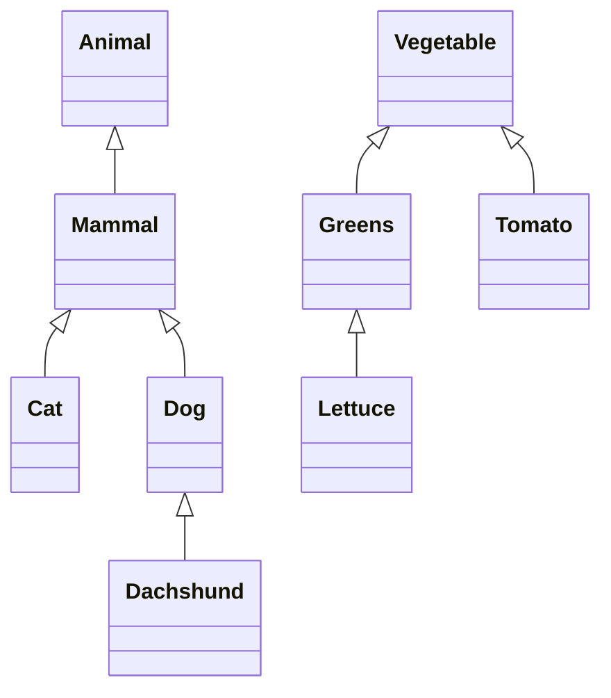

# Syntax

```ebnf
# Lexical Rules

Identifier := [a-zA-Z][a-zA-Z_]* ;
AndOp      := r"/\" | "∧" | "⋀" ;
OrOp       := r"\/" | "∨" | "⋁" ;
ArrowOp    := "->" ;
SortOp     := "::" ;
RuleOp     := "=>" ;
EqualOp    := "="  ;
MatchOp    := ":=" ;

# Syntactic Rules

Module := Item* ;

Item := Declaration
      | Submodule
      # | Statement
      ;

Declaration := VariableDeclaration
            | SymbolDeclaration
            | SortDeclaration
            | RuleDeclaration
            | EquationDeclaration
            # | StrategyDeclaration
            ;

SortDeclaration := "sort" SortList ("<" SortList)? ";" ;

SortList := Identifier ("," Identifier)* ;

SymbolDeclaration := ("symbol"|"sym") Identifier ("/" NaturalNumber)? (SortOp SortSpec)? ConditionSpec? AttributeSpec? ";" ;

VariableDeclaration := ("variable"|"var") Identifier ("/" NaturalNumber)? (SortOp SortSpec)? ConditionSpec? AttributeSpec? ";" ;

#Operator := ("operator"|"op") Identifier ("/" NaturalNumber)? (SortOp SortSpec)? ConditionSpec? AttributeSpec? ";" ;

RuleDeclaration := ("rule" | "rl") Term RuleOp Term ConditionSpec? ";" ;

EquationDeclaration := ("equation" | "eq") Term EqualOp Term ConditionSpec? ";" ;

MembershipDeclaration := ("membership" | "mb") Term SortOp SortSpec ConditionSpec? ";" ;

Submodule := "mod" Identifier "{" Module "}" ;

# Statement := BindStatement
#            | ReduceStatement
#            | MatchStatement
#            | MatchAllStatement
#            | UnifyStatement
#            | ReplaceStatement
#            | ReplaceAllStatement
#            ;

Term :=
    Identifier
    | Term "(" Term ("," Term)* ")"
    | "(" Term ")"
    ;

SortSpec :=
    Identifier
    | SortSpec+ ArrowOp SortSpec
    | "(" SortSpec ")"
    ;

Attribute :=
    "assoc" | "associative"
    | "comm" | "commutative"
    | "ctor" | "constructor"
    | "id" "(" Term ")"
    ;

AttributeSpec := "[" AttributeList "]" ;

ConditionSpec := "if" Condition (AndOp Condition)* ;

Condition := 
    EqualityCondition
    | MatchCondition
    | MembershipCondition
    | RewriteCondition
    ;

EqualityCondition := 
    Term EqualOp Term # Regular Equation
    | Term            # Boolean Expression (short for term = true)
    ;

MatchCondition := Term MatchOp Term ;

MembershipCondition := Term SortOp SortSpec ;

RewriteCondition := Term RuleOp Term ;

```

## Basic expression syntax

Expressions are M-expressions using parentheses as in standard mathematical syntax. To apply a function, append the 
argument list wrapped in parentheses to the function head:

```
expr(arg1, arg2, arg3)
```

A function head can be any other expression:

```
f(x, y)(p, q)
```

Here the head is itself a function application `f(x, y)`.

## Symbols

A symbol is a name with attributes arity, sort, etc. The name is a concrete value, not a variable, and cannot be rebound or unbound. The properties of a symbol can be declared with the `symbol` (`sym`) keyword:

```
free symbol f/3 : Animal;
```

This declares a symbol of arity 3 and sort `Animal` in the `free` equational theory.

Any attribute can be omitted from a symbol declaration. The omitted attributes take default values.

```
symbol g;
```

This declares a symbol in the `free` equational theory that is variadic with sort `None`. Symbols do not have to be declared; an undeclared symbol is equivalent to declaring the symbol with no explicit attributes.

### Functions vs. Symbols

A function is any symbol of arity greater than 0. Generally we use the word symbol to refer to a symbol of arity 0 and function to refer to a symbol of arity greater than 0.

## Variables

Variables are names that can be bound to values. Variables can be constrained so that they can only bind to symbols with certain attributes. Variable declarations mirror symbol declarations but using the `variable` (`var`) keyword.

```
free variable X/4: Vegetable;
```

Here `X` is constrained to only bind to a symbol in the `free` theory of arity `4` and sort `Vegetable`.

## Sorts

A sort is a type. The subsort relation `<` defines a lattice of sorts. The relation is defined by sort declarations.

```
sort Vegetable;
sort Greens < Vegetable;
sort Lettuce < Greens;
sort Tomato < Vegetable;

sort Animal;
sort Mammal < Animal;
sort Cat < Mammal;
sort Dog < Mammal;
sort Dachshund < Dog;
```

These declarations define a lattice with two connected components:


